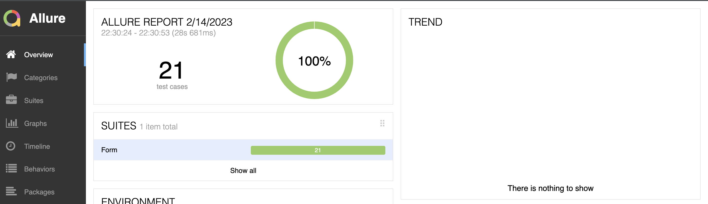
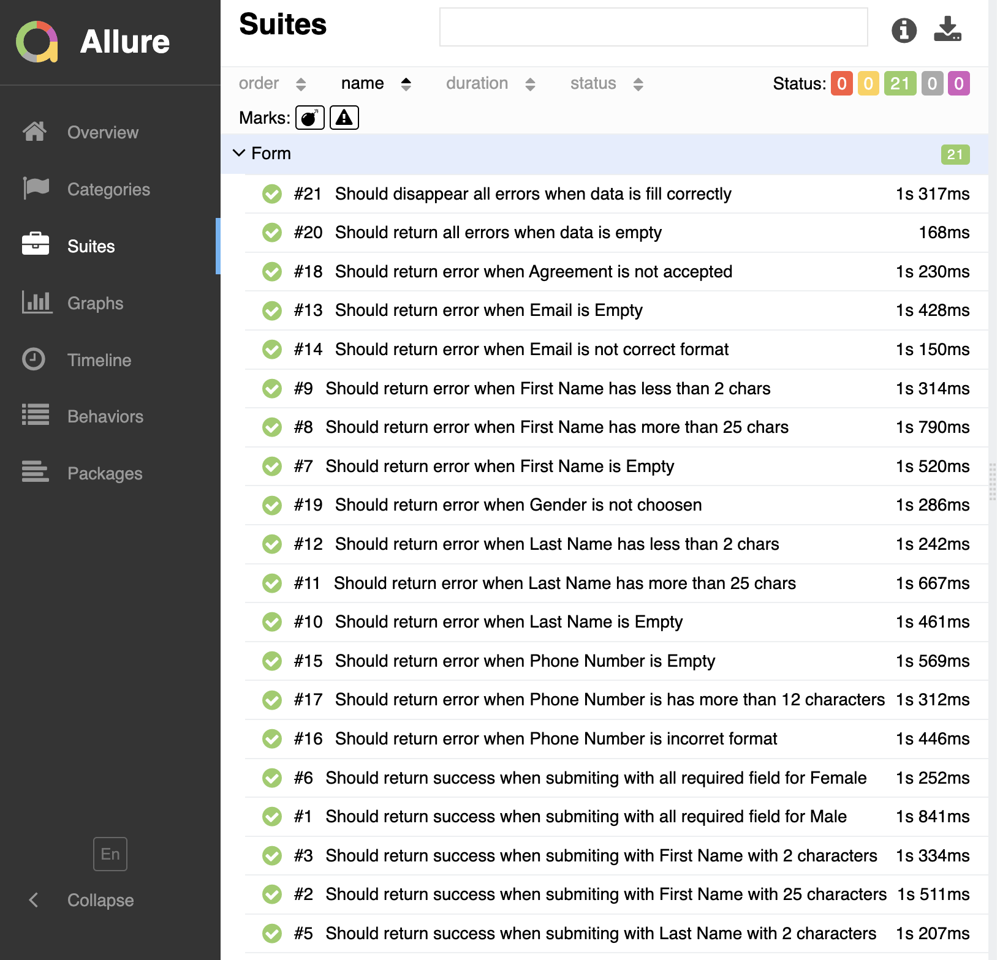
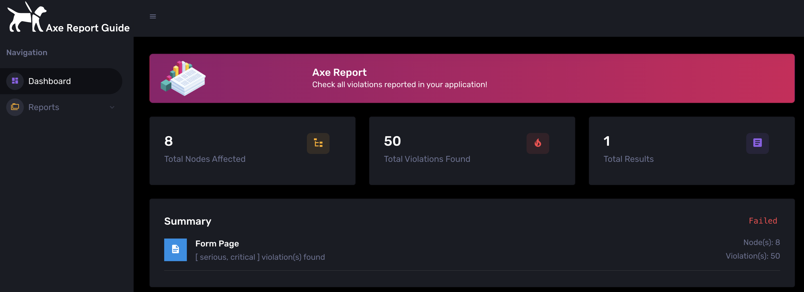
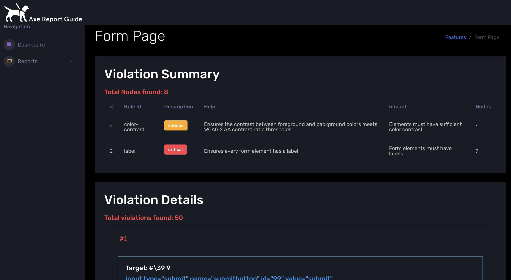

[](https://github.com/araujosnathan/cypress-testing-example/actions/workflows/e2e.js.yml)
[](https://github.com/araujosnathan/cypress-testing-example/actions/workflows/a11y.js.yml)

# Cypress-Testing-Example

This is a sample project to automate web application using cypress + (cypress-axe + axe report guide) to check accessibility tests.

# How to run the tests?

```
git clone https://github.com/araujosnathan/cypress-testing-example.git
```

# What is need for running it?

You need to have `node` installed in your machine. <br>
And you will need to have `nvm` installed for managing versions of node. <br>
After these installations, you can execute command below for installing all dependencies.

```
nvm install 16 (You should use a version equal or above 15)
nvm use 16
npm install (This command installs all dependecies of the project)
```

# Running the E2E Tests

```
npm run cy:run:e2e
```

After run the tests, it will create the `allure-results` in root folder, then you can generate the report with allure framework:

```
npm run allure:report
```

This command will generate the `allure-report` folder. You need install allure and then execute `allure open`, it will open the allure server with all results like this:

**Allure Overview**



**Allure Suites**


<br></br>

# Running the Accessibility Tests (A11Y)

```
npm run cy:run:a11y
```

This test will generate a file with all Axe Results in `results/a11y` folder

You can generate the Axe Report Guide following the steps in my own repo in [Axe Report Guide](https://github.com/araujosnathan/axe-report-guide).
But for this sample, I already generated the report, you can see an example in `results/a11y/axe-report`. When you open the `axe-report-pretty` you can see the Overview for A11Y, like:



You can acces the Report Tab to see all violations:


